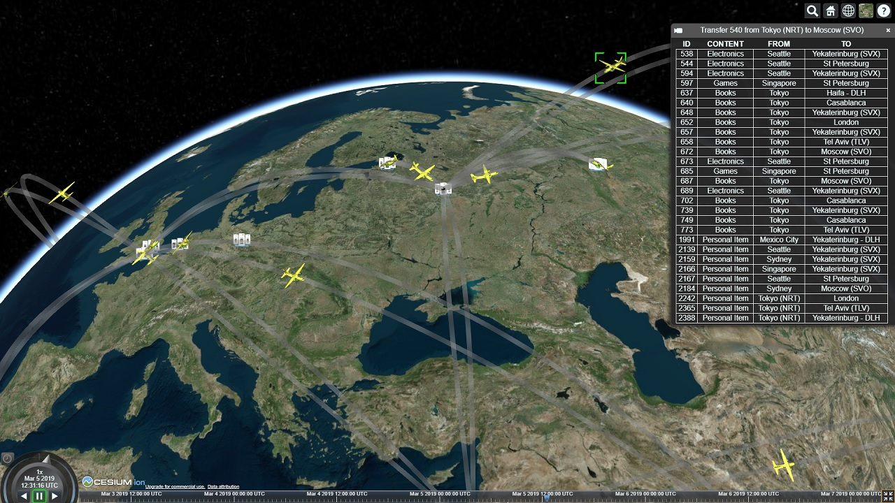
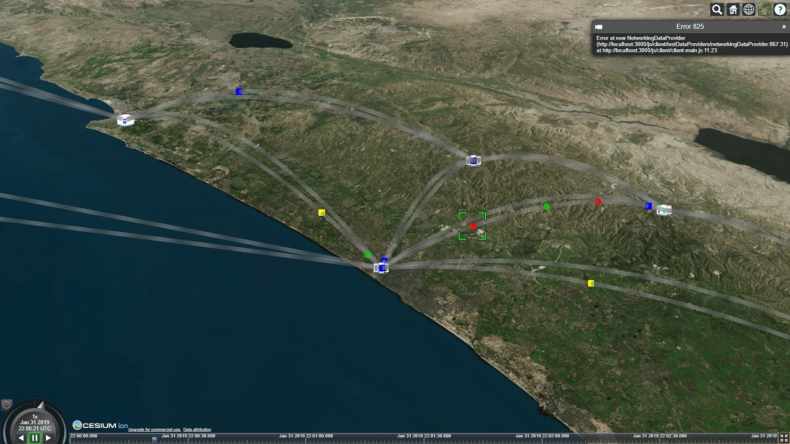
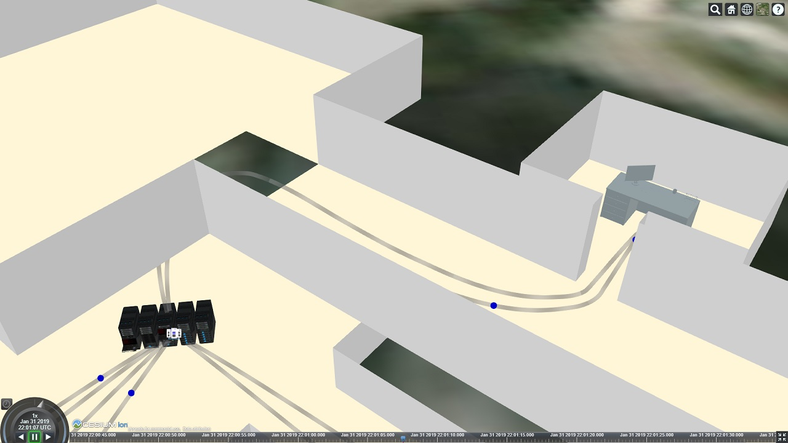
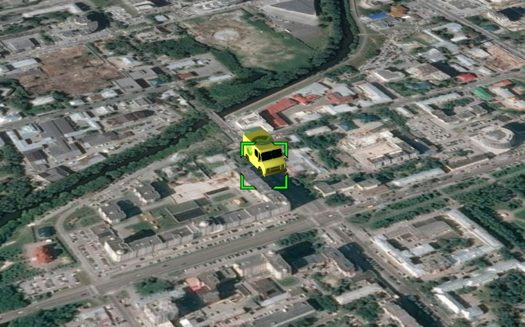

# Geotramon
A browser-based tool for monitoring transportation and traffic on the globe.

## Features

* Can be used for completely different types of "traffic", including network data and vehicles.
* Supports free navigation in both space and time.
* Supports custom 3D structures on any level of scale.

